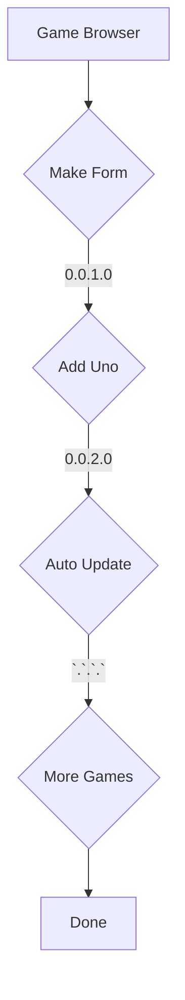

* Games
  * [Uno](https://github.com/Travis-Findley/Uno)
    * Uno 2-4 players online eventualy, normal and flip, with AI.
  * [Random Number Guesser](https://github.com/Travis-Findley/RandomNumbGuess)
    * Guess the random number
  * [Dice Role](https://github.com/Travis-Findley/DiceRole/blob/main/README.md)
    * It roles a die
  * [Change Making Game](https://github.com/Travis-Findley/ChangeGame)
    * Play a game for making Change up to 1 doller
  * [Joke Teller](https://github.com/Travis-Findley/JokeTeller)
    * This tells a joke when user clicks a button
  

