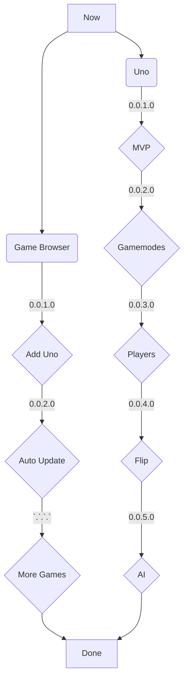

```mermaid
graph TD;
    A[Now]-->B(Uno);
    B-->|0.0.1.0| C{MVP};
    C-->|0.0.2.0| D{Gamemodes};
    D-->|0.0.3.0| E{Players};
    E-->|0.0.4.0| F{Flip};
    F-->|0.0.5.0| G{AI};

    A-->H(Game Browser);
    H-->|0.0.1.0| I{Add Uno};
    I-->|0.0.2.0| J{Auto Update};
    J-->|`.`.`.`| K{More Games};

    K-->Z[Done];
    G-->Z;
```
