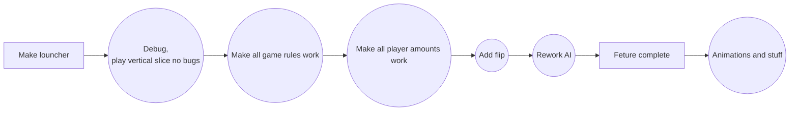

# GamesRepo
This is where the game louncher goes; also where I will place all my 

```mermaid
graph LR
A[uno] --> B((Debug, 
play vertical slice no bugs)) --> C((Make all game rules work)) --> D((Make all player amounts work)) --> E((Add flip)) --> F((Rework AI)) --> G[Feture complete] --> h((Animations and stuff))
A[Make louncher]
```
